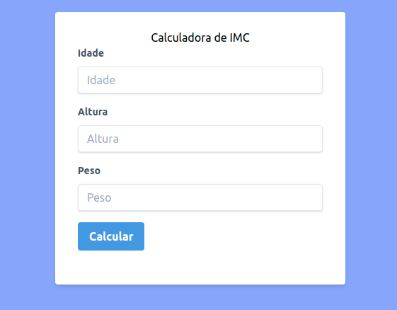

# Calculadora de IMC

<h1 align="center">
  
  
  
</h1>  

## Sobre este projeto

_" É uma simples calculadora de IMC, onde colocamos os dados de idade, altura e peso. Ela retorna o resultado informando se está com peso normal ou acima do peso"._

## Construído com

- [HTML](https://www.w3schools.com/html/)
- [CSS](https://www.w3schools.com/css/)
- [JAVASCRIPT](https://www.w3schools.com/js/)

